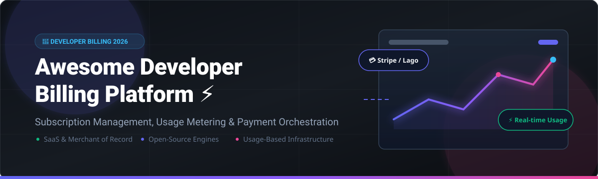

  

# 💳 Awesome Developer Billing Platform 🚀

  

## 🌟 Top Developer Billing Platforms Ecosystem

A curated list of **SaaS products** and **Open-Source GitHub projects** for **Developer Billing**, **Subscription Management**, **Usage Metering**, **Invoicing**, and **Payment Orchestration**.

**Last updated: October 2026** 📅

---

### 📊 Market Overview & Industry Dynamics
> 💡 **Market Size & Structure**: The global developer billing and subscription management market is estimated at **$12.5 Billion in 2026** (projected to reach $24.8 Billion by 2030 at a 18.7% CAGR). The market is **moderately fragmented**: category giant Stripe dominates payment processing and general billing, while specialized high-volume usage-based billing infrastructure (e.g., Lago, Orb, OpenMeter) and Merchant of Record solutions (Paddle, Lemon Squeezy) represent rapidly expanding high-growth sub-segments.

---

## 📑 Table of Contents
- [🏢 SaaS & Hosted Billing Platforms](#-saas--hosted-billing-platforms)
- [🔓 Open-Source GitHub Projects](#-open-source-github-projects)
  - [⚡ Full Billing & Subscription Platforms](#-full-billing--subscription-platforms)
  - [⏱️ Metering & Usage-Based Engines](#%EF%B8%8F-metering--usage-based-engines)
  - [🧾 Invoicing & Accounting Foundations](#-invoicing--accounting-foundations)
- [🤝 How to Contribute](#-how-to-contribute)
- [❤️ Support & Sponsorship](#%EF%B8%8F-support--sponsorship)
- [📈 Star History](#-star-history)
- [⚠️ Disclaimer](#%EF%B8%8F-disclaimer)

---

## 🏢 SaaS & Hosted Billing Platforms

| Platform | Starting Paid Tier Pricing | Free Tier / Trial Limit | Scale / Valuation / Revenue | Highlights & Tradeoffs |
| :--- | :--- | :--- | :--- | :--- |
| **[Stripe Billing](https://stripe.com/billing)** 💳 | **0.5% - 0.8%** per recurring volume | **First $100,000** in lifetime billing volume processed free | **$103 Billion** Valuation ($14B+ ARR) | Default choice for Stripe users; handles subscriptions, invoicing, and rev-rec. |
| **[Chargebee](https://www.chargebee.com/)** 🐝 | **$299/month** (Growth plan) + 0.5% overage | **14-day free trial** (Full access, no credit card required) | **$3.5 Billion** Valuation ($100M+ ARR) | Enterprise subscription & revenue operations engine with dunning and ASC 606 compliance. |
| **[Paddle](https://www.paddle.com/)** 🚣 | **5% + 50¢** per transaction | **No fixed monthly fee** (Pay-as-you-go per transaction) | **$1.4 Billion** Valuation ($150M+ Revenue) | Complete Merchant of Record (MoR) platform handling global SaaS tax compliance & remittance. |
| **[Recurly](https://recurly.com/)** 🔄 | **$249/month** (Starter plan) + 0.9% revenue share | **14-day free trial** | **~$600 Million** Valuation ($80M+ Revenue) | Subscription management specialist focused on churn reduction & enterprise billing. |
| **[Lemon Squeezy](https://www.lemonsqueezy.com/)** 🍋 | **5% + 50¢** per transaction | **No monthly subscription fee** (Pay-per-sale model) | **Stripe Acquisition (2024)** (~$100M+ valuation unit) | Developer-centric MoR for SaaS, digital downloads, and subscriptions with tax handling. |
| **[FastSpring](https://fastspring.com/)** ⚡ | **8.9%** per transaction or **8.6% + $1.00** | **14-day free trial** (Custom test store setup) | **~$500 Million** Valuation ($75M+ Revenue) | Global MoR platform tailored for B2B SaaS and desktop software vendor compliance. |
| **[Metronome](https://metronome.com/)** ⏱️ | **$1,000/month** base platform commitment | **30-day sandbox evaluation account** | **Stripe Acquisition (2025)** (~$500M valuation unit) | Enterprise usage-based billing platform powering modern AI and usage-driven SaaS. |
| **[Orb](https://www.orb.com/)** 🔮 | **$500/month** base infrastructure tier | **14-day free developer sandbox** | **$250 Million** Valuation (Series B backed) | Usage-based billing platform designed for real-time high-volume event ingestion. |

---

## 🔓 Open-Source GitHub Projects

### ⚡ Full Billing & Subscription Platforms

| Project | GitHub Stars | License | Key Features & Architecture |
| :--- | :--- | :--- | :--- |
| **[Lago](https://github.com/getlago/lago)** 🦩 |  | AGPL-3.0 | Most popular open-source usage billing engine. Event ingestion, 6 aggregation types, invoicing & multi-PSP routing. Used by Mistral & Groq. |
| **[Kill Bill](https://github.com/killbill/killbill)** 🗡️ |  | Apache-2.0 | Enterprise-grade subscription billing engine with 14+ years in production. Java-based multi-tenant architecture with rich plugin system. |
| **[UniBee](https://github.com/UniBee-Billing/unibee)** 🐝 |  | AGPL-3.0 | Universal gateway-agnostic billing for SaaS. Integrates Stripe, PayPal, & local gateways simultaneously with full dunning recovery. |
| **[Meteroid](https://github.com/meteroid-oss/meteroid)** ☄️ |  | AGPL-3.0 | High-performance Rust billing platform. Combines PostgreSQL (billing), ClickHouse (analytics), and Kafka for high-event throughput. |

---

### ⏱️ Metering & Usage-Based Engines

| Project | GitHub Stars | License | Description & Use Case |
| :--- | :--- | :--- | :--- |
| **[Lotus](https://github.com/uselotus/lotus)** 🪷 |  | MIT | Python-based pricing and packaging infrastructure for SaaS pricing experimentation and usage tracking. |
| **[OpenMeter](https://github.com/openmeterio/openmeter)** 📊 |  | Apache-2.0 | Real-time usage metering for AI, API, and cloud infrastructure. Integrates seamlessly with Stripe Billing and Lago. |
| **[Flexprice](https://github.com/flexprice/flexprice)** 🏷️ |  | Apache-2.0 | Open-source pricing infrastructure to eliminate Stripe revenue share cuts. Modular metering, credits, and billing engine. |

---

### 🧾 Invoicing & Accounting Foundations

| Project | GitHub Stars | License | Description & Use Case |
| :--- | :--- | :--- | :--- |
| **[Invoice Ninja](https://github.com/invoiceninja/invoiceninja)** 🥷 |  | Open Source | Complete invoicing and billing software with client portal, time tracking, multi-currency support, and mobile apps. |
| **[IDURAR ERP/CRM](https://github.com/idurar/idurar-erp-crm)** 💼 |  | MIT | Modern MERN stack ERP/CRM with full invoicing, quotation, inventory, and payment processing functionality. |
| **[Crater](https://github.com/crater-invoice-inc/crater)** 🌋 |  | AGPL-3.0 | Self-hosted PHP invoice web app for freelancers and small businesses with estimate generation and client portals. |
| **[Akaunting](https://github.com/akaunting/akaunting)** 🧮 |  | GPL-3.0 | Modular double-entry accounting and invoicing software with an extensive app marketplace. |
| **[InvoicePlane](https://github.com/InvoicePlane/InvoicePlane)** ✈️ |  | MIT | Lightweight self-hosted PHP invoicing system for client management, quote-to-invoice workflow, and payment gateway integration. |

---

## 🤝 How to Contribute

Contributions are very welcome! 🚀 Follow these simple steps:

1. **Fork** the repository 🍴
2. **Create** a new branch (`git checkout -b add-awesome-billing-tool`) 🌿
3. **Add** your entry to `README.md` keeping formatting consistent 📝
4. **Submit** a Pull Request with a short description of the tool 📬

---

## ❤️ Support & Sponsorship

If you find this repository helpful for evaluating billing infrastructure or building SaaS products, please consider supporting the project! 🌟

- ⭐ **Star this repo** on GitHub to help others discover it!
- 🔀 **Fork it** to customize it for your team's tech stack evaluations.
- 💬 **Share it** with fellow SaaS founders, API engineers, and product managers!
- ☕ **Buy me a coffee / Sponsor**: [GitHub Sponsors Dashboard](https://github.com/sponsors/ishandutta2007)

Your sponsorship helps keep this list continuously updated with high-quality, verified data! Thank you! 🙌

---

## 📈 Star History

---

## ⚠️ Disclaimer

- This is a **community-curated** list — not exhaustive and not an official endorsement.
- Developer billing platforms handle sensitive financial and payment data; always ensure compliance with PCI DSS, PSD2, SOC 2, and applicable local tax laws.
- **Open-source ecosystem note**: Open-source solutions like Lago and Kill Bill offer zero revenue-share fees and complete data sovereignty, but require engineering maintenance. Managed SaaS platforms (Stripe, Chargebee, Paddle) offer managed uptime, Merchant of Record tax compliance, and faster time-to-market. Choose based on your team's capacity and operational priorities.

---

Made with ❤️ for SaaS Founders, API Engineers, &amp; Billing Architects worldwide.

